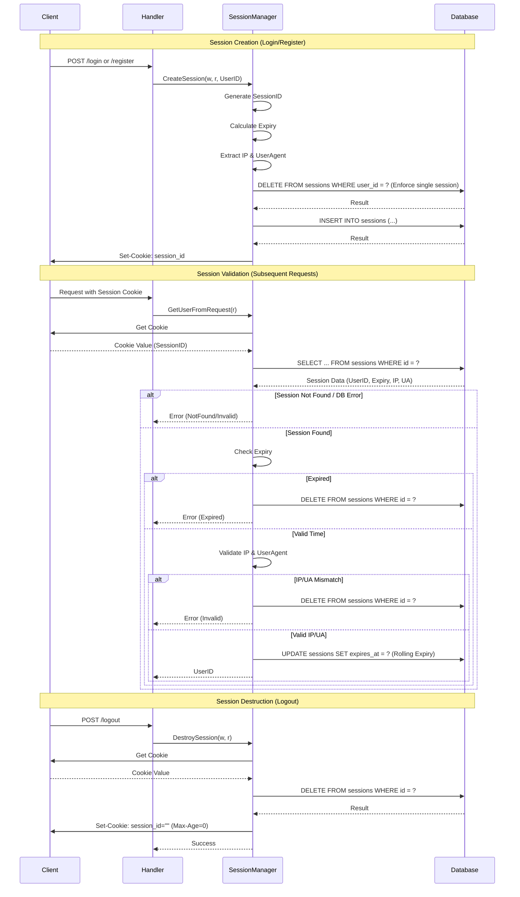

# Session Management UML

## Sequence Diagram

```mermaid
sequenceDiagram
    participant Client
    participant Handler
    participant SessionManager
    participant Database

    %% Session Creation (Login/Register)
    Note over Client, Database: Session Creation (Login/Register)
    Client->>Handler: POST /login or /register
    Handler->>SessionManager: CreateSession(w, r, UserID)
    SessionManager->>SessionManager: Generate SessionID
    SessionManager->>SessionManager: Calculate Expiry
    SessionManager->>SessionManager: Extract IP & UserAgent
    SessionManager->>Database: DELETE FROM sessions WHERE user_id = ? (Enforce single session)
    Database-->>SessionManager: Result
    SessionManager->>Database: INSERT INTO sessions (...)
    Database-->>SessionManager: Result
    SessionManager->>Client: Set-Cookie: session_id

    %% Session Validation (Middleware/Requests)
    Note over Client, Database: Session Validation (Subsequent Requests)
    Client->>Handler: Request with Session Cookie
    Handler->>SessionManager: GetUserFromRequest(r)
    SessionManager->>Client: Get Cookie
    Client-->>SessionManager: Cookie Value (SessionID)
    SessionManager->>Database: SELECT ... FROM sessions WHERE id = ?
    Database-->>SessionManager: Session Data (UserID, Expiry, IP, UA)
    
    alt Session Not Found / DB Error
        SessionManager-->>Handler: Error (NotFound/Invalid)
    else Session Found
        SessionManager->>SessionManager: Check Expiry
        alt Expired
            SessionManager->>Database: DELETE FROM sessions WHERE id = ?
            SessionManager-->>Handler: Error (Expired)
        else Valid Time
            SessionManager->>SessionManager: Validate IP & UserAgent
            alt IP/UA Mismatch
                SessionManager->>Database: DELETE FROM sessions WHERE id = ?
                SessionManager-->>Handler: Error (Invalid)
            else Valid IP/UA
                SessionManager->>Database: UPDATE sessions SET expires_at = ? (Rolling Expiry)
                SessionManager-->>Handler: UserID
            end
        end
    end

    %% Session Destruction (Logout)
    Note over Client, Database: Session Destruction (Logout)
    Client->>Handler: POST /logout
    Handler->>SessionManager: DestroySession(w, r)
    SessionManager->>Client: Get Cookie
    Client-->>SessionManager: Cookie Value
    SessionManager->>Database: DELETE FROM sessions WHERE id = ?
    Database-->>SessionManager: Result
    SessionManager->>Client: Set-Cookie: session_id="" (Max-Age=0)
    SessionManager-->>Handler: Success
```
